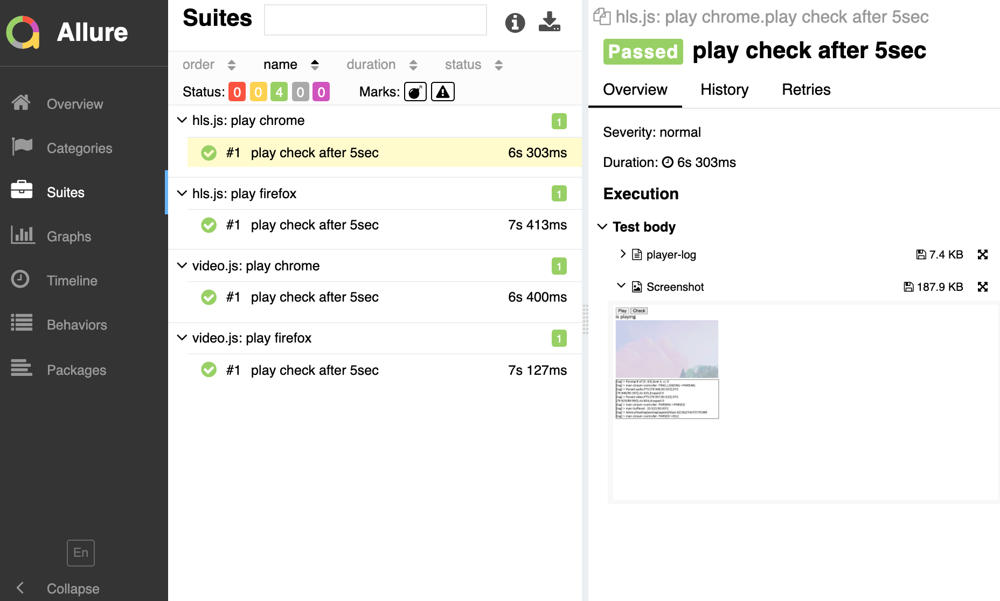

# Simple video stream test example with Jasmine, Protractor, Allure Report

Test video stream with multiple players on multiple browsers.

* Player: hls.js, video.js
* Browser: chrome, firefox

## Inspired by
[Demuxed 2019 - Building an automated testing suite: How to gain confidence that your release will not break playback for any platform/player/OS/format combination (joint talk)](https://www.youtube.com/watch?v=oEo9_gRk6x8&list=PLkyaYNWEKcOf_C_6W45abNvXMb40xUUqh&index=12)

## Warning
Only tested with Mac

## Usage

Install packages
```sh
npm install -g webdriver-manager
npm update
```

Run once
```sh
./ready.sh
```

Test and show results
```sh
./run.sh
```


